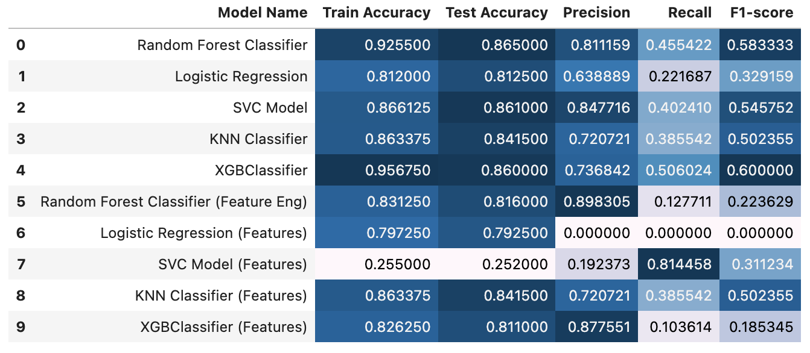

# Customer Churn Prediction Model
This repository has my code for my [bank customer churn prediction model](https://www.kaggle.com/code/johannaschmidle7/titanic-survival-predictor) for the [Churn Modelling
classification data set](https://www.kaggle.com/datasets/shrutimechlearn/churn-modelling) on Kaggle. 
The data set contains details of a bank's customers. The target variable is a binary variable reflecting whether the customer left the bank (closed their account) or continue to be a customer.

## Motivation
**Goal:** build a machine learning model to predict if a bank's customer will churn (leave the bank) or not.  
For each instance in the test set, you must predict a 0 or 1 value for the target variable  (Classifier).

## Steps
1. **EDA**
   - data.describe()
   - Pie chart
   - Correlation heatmap
   - Histograms
   - KDE plots
   - Univariate Exploration
2. **Feature Engineering** (note I will train models on original features and engineered features separately)
   - **Age Group:** grouping customers into age categories can capture non-linear relationships and improve the model’s ability to identify patterns. This approach reduces noise and enhances interpretability by smoothing out variations within age ranges.
  - **Balance to Estimated Salary Ratio:** this provides insight into a customer's financial stability. A higher ratio may indicate financial strain, which could increase the likelihood of the customer leaving the bank.
  - **Tenure Group:** similar to age, tenure will be grouped into categories to capture non-linear effects and reduce noise. This helps the model recognize patterns associated with different lengths of customer tenure, which may not be as easily detected using tenure as a continuous variable.
  - **Loyalty Index:** a composite feature reflecting customer loyalty, which combines tenure, the number of products held by the customer, and whether they are an active member. This aims to capture the likelihood of a customer churning, with the IsActiveMember feature given a higher weight due to its stronger association with customer retention.
  - **Balance Above 0:** a binary feature indicating whether the customer's account balance is at or above zero. This simple indicator can help the model identify customers who might be at risk of leaving the bank if they are consistently maintaining a zero balance.
3. **Preprocessing**
    - Split data
    - Create pipeline
        - OneHot encoding
        - StandardScaler
4. **Create Models**
  - **Model 1:** Random Forest Classifier 
  - **Model 2:** Logistic Regression
  - **Model 3:** Support Vector Machine
  - **Model 4:** K-Nearest Neighbours
  - **Model 5:** XGBoost
  - Visualize models:
      - Confusion matrix
      - Display feature importance (when applicable)
5. **Create Models with Engineered Features**
  - Repeat above (10 models total)
    
## Result of Model Evaluations

    

## Data
The dataset used in this project is available publicly on Kaggle: [https://www.kaggle.com/datasets/shrutimechlearn/churn-modelling](https://www.kaggle.com/datasets/shrutimechlearn/churn-modelling)

## Technologies
Python
- pandas, numpy, matplotlib, seaborn
- sklearn (OneHotEncoder, StandardScaler, make_column_transformer, ColumnTransformer, Pipeline, RandomForestClassifier, LogisticRegression, SVC, KNeighborsClassifier, XGBClassifier, cross_val_score, GridSearchCV, ConfusionMatrixDisplay)
- XGBoost
